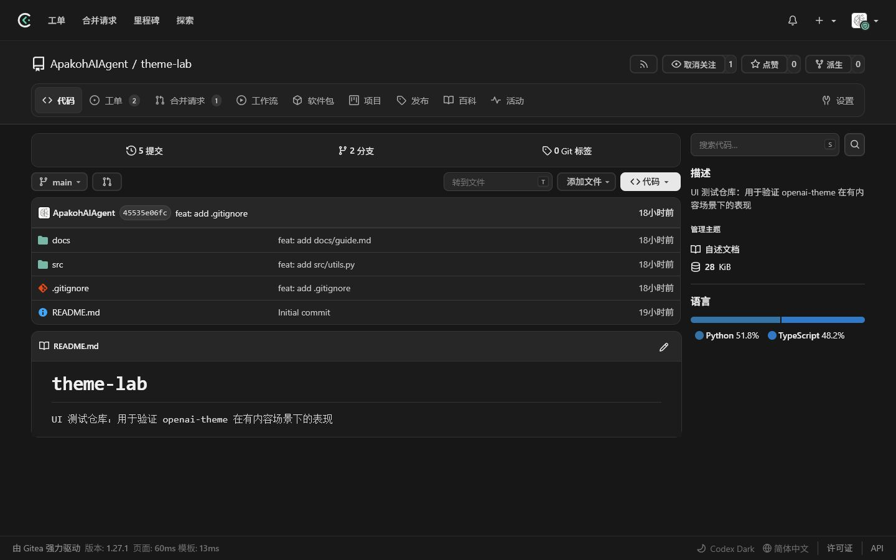
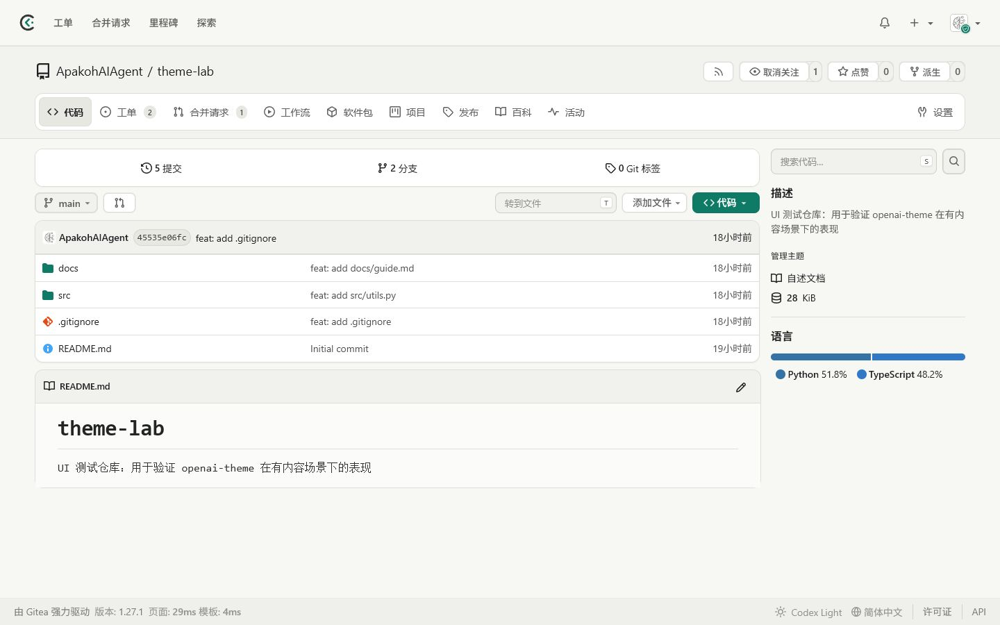
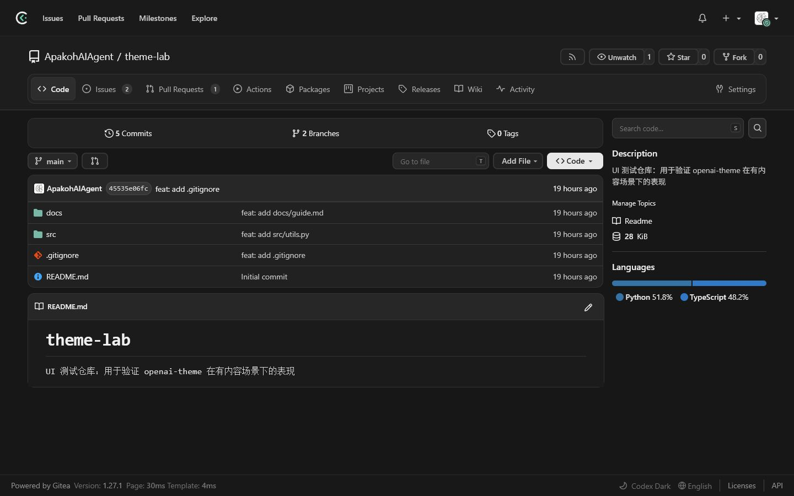
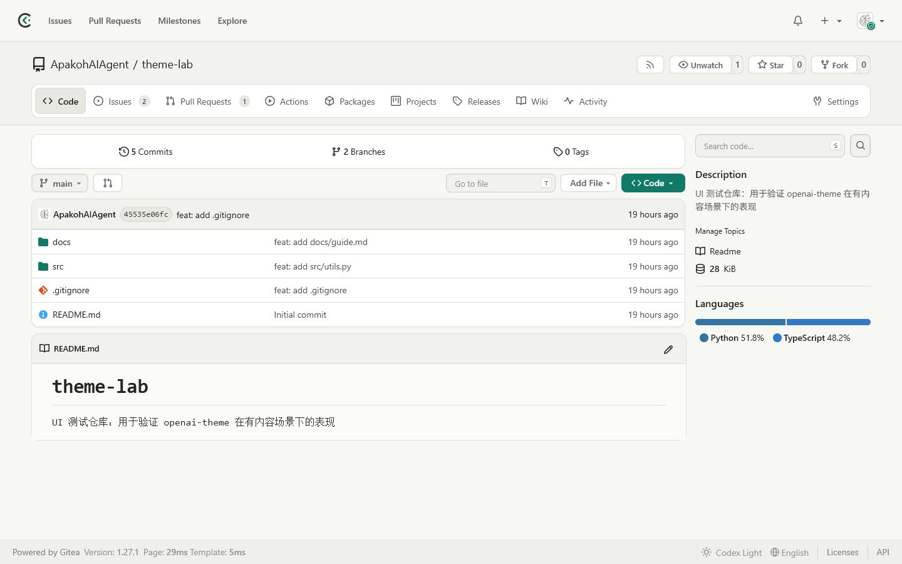

<p align="center">
  <picture>
    <source media="(prefers-color-scheme: dark)" srcset="./assets/codex-logo-dark.svg">
    <source media="(prefers-color-scheme: light)" srcset="./assets/codex-logo-light.svg">
    
  </picture>
</p>

<h1 align="center">Codex themes for Gitea</h1>

<p align="center">
  A calm, focused light-and-dark workspace for Gitea 1.27.x.<br>
  为 Gitea 1.27.x 打造的舒适、克制、专注的明暗双主题。
</p>

<p align="center">
  
  
  
</p>

<p align="center"><a href="#中文">中文</a> · <a href="#english">English</a></p>

## Preview / 效果预览

### 中文界面

| Codex Dark · 暗色                                                    | Codex Light · 浅色                                                     |
| -------------------------------------------------------------------- | ---------------------------------------------------------------------- |
|  |  |

### English UI

| Codex Dark                                                            | Codex Light                                                             |
| --------------------------------------------------------------------- | ----------------------------------------------------------------------- |
|  |  |

> Screenshots were captured from the public `ApakohAIAgent/theme-lab` test repository. They contain no private repositories, email addresses, server addresses, credentials, or administrative pages.<br>
> 截图取自公开的 `ApakohAIAgent/theme-lab` 测试仓库，不包含私有仓库、邮箱、服务器地址、凭据或管理后台。

---

## 中文

`codex-dark` 与 `codex-light` 共用同一套布局、组件、浮层、圆角、间距和响应式规则，只替换视觉色板。导航栏使用专属的 Codex 线性 Logo：透明背景、无实心边框，并针对明暗表面分别调整颜色，不使用灰度滤镜。

### 设计重点

| 方向       | 实现                                                           |
| ---------- | -------------------------------------------------------------- |
| 长时间阅读 | 暗色避免纯黑，浅色使用低对比暖灰画布，减少眩光与大面积纯白刺激 |
| 信息优先   | 保留仓库、工单、合并请求、Actions 和设置页原有信息密度         |
| 清晰层级   | 普通内容依靠间距和细边框分层，阴影仅用于菜单与浮层             |
| 组件一致   | 统一菜单选中态、组合输入框、attached 面板、卡片圆角和模块间距  |
| 响应式     | 桌面端限制内容宽度；窄屏避免横向溢出并保留可操作区域           |
| 可访问性   | 保留焦点环、状态色、键盘交互和 `prefers-reduced-motion` 支持   |

### 文件结构

```text
assets/
├── codex-logo-dark.svg
└── codex-logo-light.svg

codex-dark/
└── theme-codex-dark.css

codex-light/
└── theme-codex-light.css

docs/screenshots/
├── codex-dark-zh.png
├── codex-light-zh.png
├── codex-dark-en.png
└── codex-light-en.png
```

### 安装

将两份主题和 Logo 安装到 Gitea custom 目录：

```bash
install -d /data/gitea/public/assets/css /data/gitea/public/assets/img

install -m 0644 codex-dark/theme-codex-dark.css \
  /data/gitea/public/assets/css/theme-codex-dark.css
install -m 0644 codex-light/theme-codex-light.css \
  /data/gitea/public/assets/css/theme-codex-light.css
install -m 0644 assets/codex-logo-dark.svg \
  /data/gitea/public/assets/img/codex-logo-dark.svg
install -m 0644 assets/codex-logo-light.svg \
  /data/gitea/public/assets/img/codex-logo-light.svg
```

在 `app.ini` 的 `[ui]` 段注册主题：

```ini
[ui]
DEFAULT_THEME = codex-dark
THEMES = codex-dark,codex-light,gitea-light,gitea-dark,gitea-auto
```

修改 `app.ini` 后需要重启 Gitea。仅替换已经注册的 CSS 或 Logo 文件时无需重启；如果仍显示旧版本，请强制刷新浏览器，因为 Gitea 会缓存静态资源。

### 兼容性

- Gitea 1.27.x
- 现代 Chromium、Firefox 与 Safari
- 主题不依赖 JavaScript 或外部运行时

### 回滚

部署前保留时间戳副本：

```bash
cp theme-codex-dark.css theme-codex-dark.css.bak.$(date +%Y-%m-%d-%H%M)
cp theme-codex-light.css theme-codex-light.css.bak.$(date +%Y-%m-%d-%H%M)
```

需要回滚时复制回旧 CSS，或将 `DEFAULT_THEME` 改为 Gitea 内置主题。只有配置发生变化时才需要重启 Gitea。

---

## English

`codex-dark` and `codex-light` share the same layout, components, floating surfaces, radii, spacing, and responsive fixes; only their visual palettes differ. The navigation bar uses a dedicated linear Codex mark with a transparent background and no solid frame. Separate light- and dark-surface colorways are provided, and no grayscale filter is applied.

### Design principles

| Goal                 | Implementation                                                                                             |
| -------------------- | ---------------------------------------------------------------------------------------------------------- |
| Long-session comfort | The dark theme avoids pure black; the light theme uses a low-contrast warm-gray canvas                     |
| Content first        | Repositories, issues, pull requests, Actions, and settings retain Gitea's native information density       |
| Clear hierarchy      | Spacing and quiet borders separate normal content; shadows are reserved for menus and floating surfaces    |
| Consistent controls  | Selected menu items, action inputs, attached panels, card radii, and module spacing follow one system      |
| Responsive layout    | Desktop content width is controlled; narrow screens avoid horizontal overflow and preserve usable controls |
| Accessibility        | Focus rings, status colors, keyboard interaction, and `prefers-reduced-motion` support remain intact       |

### Repository layout

```text
assets/
├── codex-logo-dark.svg
└── codex-logo-light.svg

codex-dark/
└── theme-codex-dark.css

codex-light/
└── theme-codex-light.css

docs/screenshots/
├── codex-dark-zh.png
├── codex-light-zh.png
├── codex-dark-en.png
└── codex-light-en.png
```

### Installation

Install both themes and logo colorways into Gitea's custom directory:

```bash
install -d /data/gitea/public/assets/css /data/gitea/public/assets/img

install -m 0644 codex-dark/theme-codex-dark.css \
  /data/gitea/public/assets/css/theme-codex-dark.css
install -m 0644 codex-light/theme-codex-light.css \
  /data/gitea/public/assets/css/theme-codex-light.css
install -m 0644 assets/codex-logo-dark.svg \
  /data/gitea/public/assets/img/codex-logo-dark.svg
install -m 0644 assets/codex-logo-light.svg \
  /data/gitea/public/assets/img/codex-logo-light.svg
```

Register the themes in the `[ui]` section of `app.ini`:

```ini
[ui]
DEFAULT_THEME = codex-dark
THEMES = codex-dark,codex-light,gitea-light,gitea-dark,gitea-auto
```

Restart Gitea after changing `app.ini`. Replacing an already registered CSS or logo file does not require a restart. If an older version remains visible, hard-refresh the browser because Gitea caches static assets.

### Compatibility

- Gitea 1.27.x
- Modern Chromium, Firefox, and Safari
- No JavaScript or external runtime dependency

### Rollback

Keep timestamped copies before deployment:

```bash
cp theme-codex-dark.css theme-codex-dark.css.bak.$(date +%Y-%m-%d-%H%M)
cp theme-codex-light.css theme-codex-light.css.bak.$(date +%Y-%m-%d-%H%M)
```

To roll back, restore the previous CSS files or select a built-in Gitea theme as `DEFAULT_THEME`. Restart Gitea only when its configuration changed.
